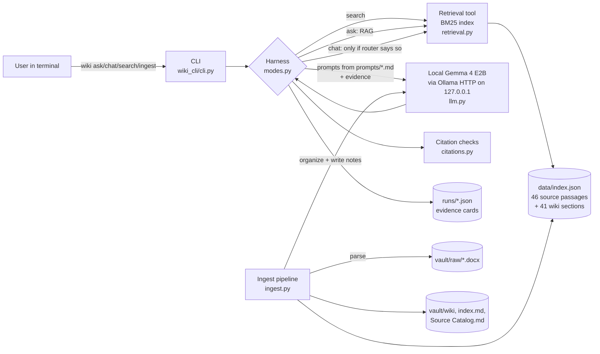
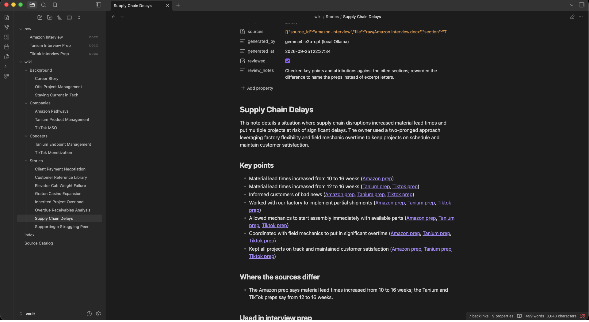
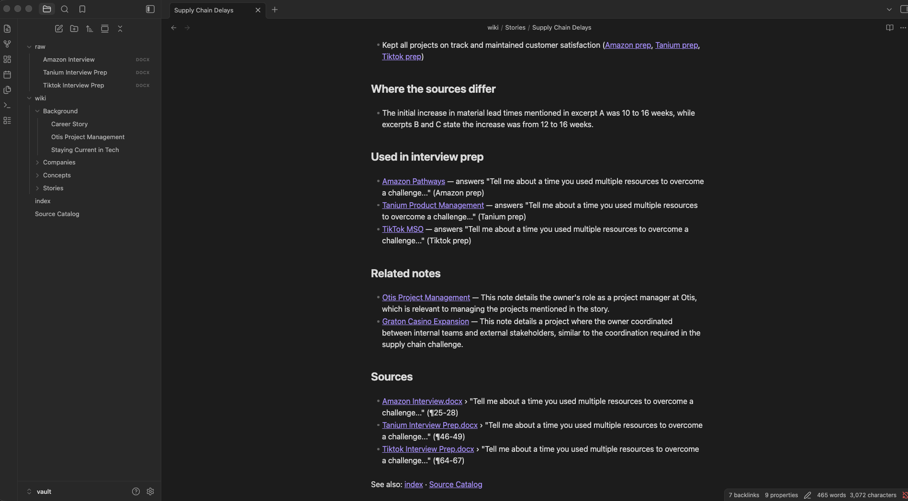
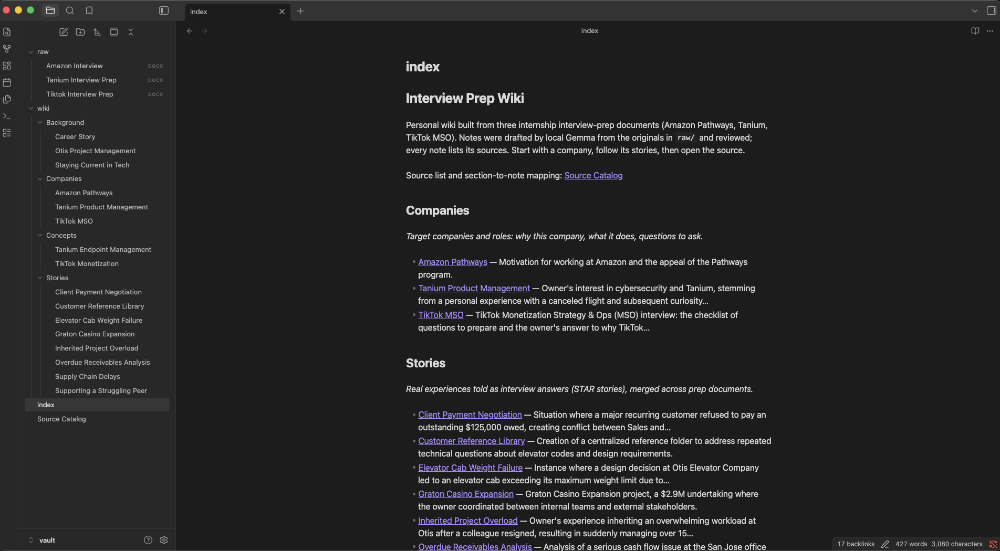
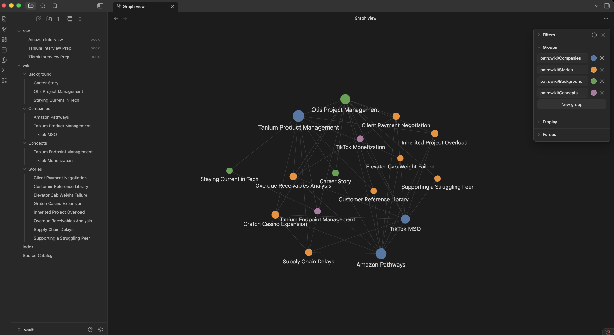
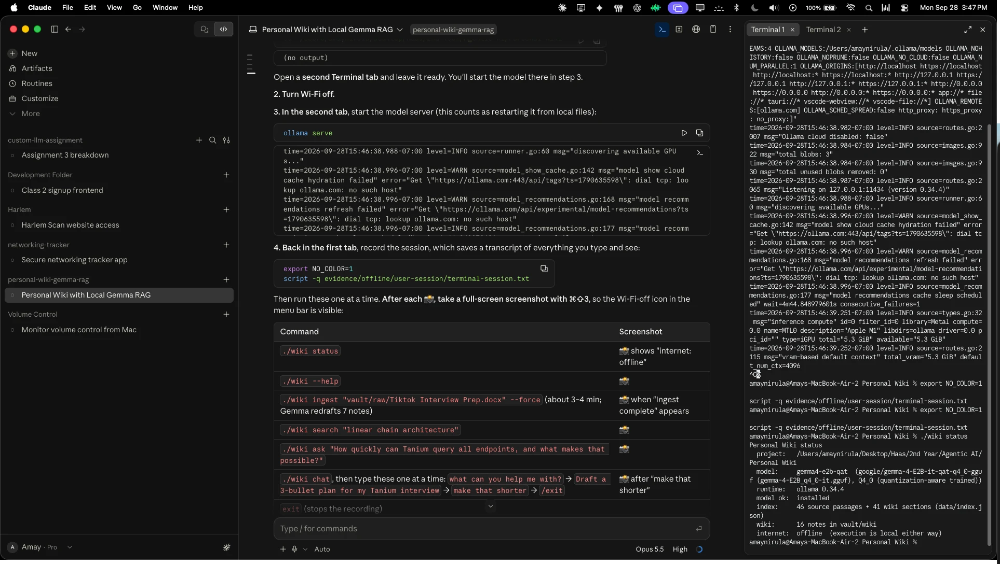
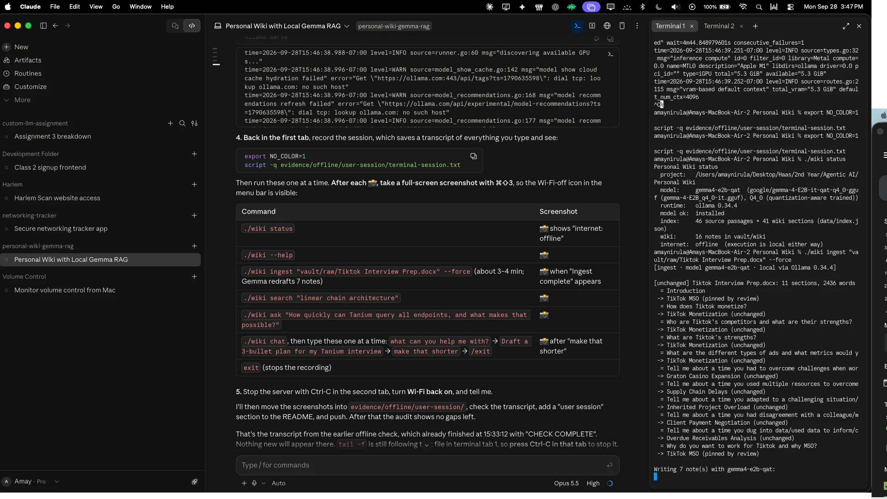
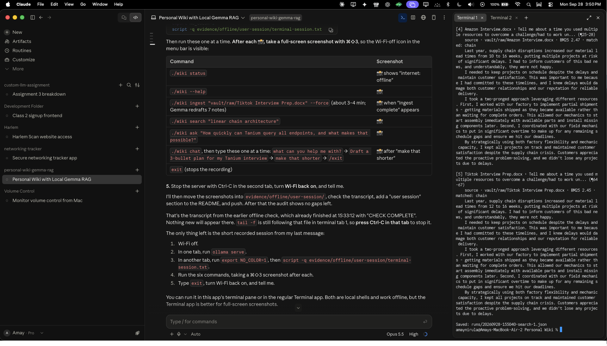

# Personal Interview-Prep Wiki — local Gemma + RAG

A command-line assistant for my internship interview prep that runs **entirely on my laptop, offline**.
A small local Gemma model turns three interview-prep documents into an Obsidian wiki, and my own
harness exposes three modes over it: **chat** (a personal assistant), **ask** (cited, standalone
factual answers) and **search** (the original passages, no model).

Class 5 · Assignment 4 · Berkeley Haas, Agentic AI.

| Start here | |
|---|---|
| CLI and harness code | [`wiki_cli/`](wiki_cli/) · launcher [`./wiki`](wiki) |
| Instructions the harness loads | [`prompts/`](prompts/) |
| The wiki (open `vault/` in Obsidian) | [`vault/index.md`](vault/index.md) · [`vault/Source Catalog.md`](vault/Source%20Catalog.md) · [`vault/wiki/`](vault/wiki/) |
| Four ask-mode evidence cards (offline run) | [`evidence/offline/ask-tests/`](evidence/offline/ask-tests/) |
| Chat / search mode checks (offline) | [`evidence/offline/mode-checks/`](evidence/offline/mode-checks/) (assessment in its README) · development runs in [`evidence/mode-checks/`](evidence/mode-checks/) |
| Offline demonstration | scripted: [`terminal-transcript.txt`](evidence/offline/terminal-transcript.txt) · [`…-search-check.txt`](evidence/offline/terminal-transcript-search-check.txt) · typed by hand, with screenshots: [`user-session/`](evidence/offline/user-session/) |
| Obsidian screenshots | [`evidence/screenshots/`](evidence/screenshots/) · shown in [section 6](#6-the-wiki-in-obsidian) |
| How the wiki was built and cleaned up | [`evidence/ingest/`](evidence/ingest/) |
| Test questions (written before building retrieval) | [`tests/ask_tests.yaml`](tests/ask_tests.yaml) · [`tests/mode_checks.md`](tests/mode_checks.md) |

---

## 1. Purpose and sources

**What the wiki is for.** Before an interview I want to find, check and re-use my own prepared material:
which Otis story answers which behavioral question, what I said about a company, and where the numbers
came from. The wiki should answer questions like *"which numbers did I use in the supply-chain story?"*
and refuse questions my notes don't cover (e.g. internship pay).

**Sources** (my own documents, in [`vault/raw/`](vault/raw/), preserved unchanged after import):

| File | What it is | Words | Sections |
|---|---|---|---|
| `Amazon Interview.docx` | Prep for Amazon Pathways (operations): tell me about yourself, why Amazon/Pathways, 8 STAR stories, questions to ask | 2,367 | 12 |
| `Tanium Interview Prep.docx` | Prep for a Tanium product-management internship: pitch, what Tanium does, why cybersecurity, STAR stories, questions to ask | 2,697 | 14 |
| `Tiktok Interview Prep.docx` | Prep for TikTok Monetization Strategy & Ops: monetization, competitors, ad funnel metrics, STAR stories, why MSO | 2,436 | 11 |

**Privacy.** The repository is public, so before ingestion I replaced two third-party first names in the
Tanium document with `[former Tanium intern]` and `[interviewer]`. Nothing else was changed; the copy in
`raw/` *is* the original for this project and has not been touched since (SHA-256 recorded in the
[Source Catalog](vault/Source%20Catalog.md)).

**How originals connect to generated pages.** Each source is split into sections (one per interview
question). Every section is assigned to exactly one wiki note, and the mapping is recorded in
`data/catalog.json` and shown to humans in [`Source Catalog.md`](vault/Source%20Catalog.md) (section →
paragraphs → note). Every note lists its sources in its properties and in a `## Sources` section with
links back to the `.docx` in `raw/` and paragraph numbers. The same STAR story appears in all three
documents, so one story note usually has three sources.

---

## 2. Quick start (exact commands)

```bash
# 1. runtime + model (one time, while online)
brew install ollama                                  # Ollama 0.34.4
ollama serve                                         # leave running in its own terminal
mkdir -p ~/models/gemma-4-E2B-it-qat-q4_0 && cd ~/models/gemma-4-E2B-it-qat-q4_0
curl -L -o gemma-4-E2B_q4_0-it.gguf \
  https://huggingface.co/google/gemma-4-E2B-it-qat-q4_0-gguf/resolve/main/gemma-4-E2B_q4_0-it.gguf
printf 'FROM ./gemma-4-E2B_q4_0-it.gguf\n' > Modelfile
ollama create gemma4-e2b-qat -f Modelfile            # Ollama detects the gemma4 renderer/parser

# 2. project
git clone https://github.com/amaynirula-design/personal-wiki-gemma-rag.git && cd personal-wiki-gemma-rag
python3 -m venv .venv && .venv/bin/pip install -r requirements.txt

# 3. use it (the ./wiki launcher runs the harness with .venv; or add the folder to PATH)
./wiki status                                        # model, runtime, index, internet
./wiki ingest vault/raw                              # sources -> wiki notes + index (skips unchanged files)
./wiki search "linear chain architecture"            # passages only, no model
./wiki ask "How quickly can Tanium query all endpoints, and what makes that possible?"
./wiki chat                                          # Scout; type /help inside
./wiki eval tests/ask_tests.yaml --out evidence/ask-tests/<run-name>   # the four test cards
./wiki check                                         # links, headings, note names, source refs
```

Errors are explicit: with the server stopped, `ask`/`chat`/`ingest` print *"Cannot reach the local
Ollama server at http://127.0.0.1:11434. Start it with: ollama serve (search mode works without the
model)"*; a missing model or missing index gets a similar message with the fix.

---

## 3. Setup, device and model choice

| | |
|---|---|
| Device | MacBook Air (M1, 2020), `MacBookAir10,1` |
| Chip | Apple M1 — 8-core CPU (4 performance + 4 efficiency), 7-core GPU |
| Memory | **8 GB unified memory** (CPU and GPU share it; no dedicated VRAM). ~22–24% free while the model is loaded |
| OS | macOS 26.5.2 (25F84) |
| Disk | 228 GB, ~33 GB free |
| Runtime | **Ollama 0.34.4** (Homebrew), llama.cpp backend on Metal, flash attention on, KV cache q8_0 |
| Model | **Gemma 4 E2B-it, QAT Q4_0** — `google/gemma-4-E2B-it-qat-q4_0-gguf`, file `gemma-4-E2B_q4_0-it.gguf` (3.35 GB, SHA-256 `fa401b55…ec6634`). Text-only: the separate 0.99 GB vision projector (`mmproj`) was not downloaded. Local name `gemma4-e2b-qat` |
| Model settings | context 8,192 tokens · thinking off · temperature ingest 0.2 / ask 0.0 / chat 0.4 / router 0.0 |
| Python | 3.14, `python-docx` 1.2.0, `PyYAML` 6.0.3 (the HTTP client and BM25 are standard library / my own code) |
| Embeddings | none — retrieval is local BM25 keyword search, so there is no embedding model to download |

**Why E2B at Q4.** With 8 GB of *shared* memory, the course guidance (E2B ≈ 2.9 GB at Q4_0) and my
measurements agree that E2B is the right size. E4B (~4.5 GB of weights, more with context) would leave
too little for macOS, Obsidian and the harness, and the 26B MoE is out of reach. I chose Google's
**quantization-aware-trained** Q4_0 build because QAT recovers most of the quality lost by 4-bit
rounding. Ollama's default `gemma4:e2b` tag is 7.2 GB (it bundles higher-precision and vision weights)
and would not fit comfortably, so I imported the official GGUF into Ollama myself.

**Measured memory and speed** (warm model; the offline run matched: 3.87-4.07 GB footprint, asks 5.7-14.1 s):

| Measurement | Value | How measured |
|---|---|---|
| Model process physical footprint | **4.27 GB** (peak 4.27 GB) | `footprint -p <llama-server pid>` — `ps` RSS (1.6 GB) and `ollama ps` (1.5 GB) under-report on Apple Silicon because Metal-mapped weights are not counted |
| Harness process | ~35 MB max RSS | `/usr/bin/time -l ./wiki ask …` |
| System memory free with model loaded | 22–24% | `memory_pressure` |
| Cold model load | ~16 s (first call after `ollama serve`) | Ollama `load_duration` |
| Prompt processing / generation | ~267 tok/s / ~19–26 tok/s | Ollama eval counters (median over 12 ask runs) |
| **One ask answer** | **~11–16 s** typical (extract ~8.6 s median + answer ~3.5 s); 31–40 s when the answer draws on three versions of a story | saved in every `runs/*-ask.json` |
| Chat turn | median 7.8 s, max 17.8 s | `runs/*-chat.json` |
| Full ingestion (3 sources, 37 sections, 15 notes, 40 model calls) | **495 s** | `evidence/ingest/02-…log` (`/usr/bin/time -l`) |
| Re-ingest unchanged sources | 0.2 s, 0 model calls | `evidence/ingest/04-reingest-idempotency.log` |
| Forced re-ingest of one source (TikTok, 7 notes redrafted) | 330 s online · **207 s offline** | `runs/`, [offline transcript](evidence/offline/terminal-transcript.txt) |

---

## 4. Architecture



The five parts are deliberately separate:

- **Model** — Gemma 4 E2B in Ollama. It only sees the messages the harness sends; it cannot read files,
  remember earlier runs or call tools. ([`llm.py`](wiki_cli/llm.py) is a ~150-line HTTP client.)
- **Retrieval tool** — [`retrieval.py`](wiki_cli/retrieval.py): my own BM25 index over *original*
  source passages (kind `source`) and reviewed wiki-note sections (kind `wiki`). It finds evidence and
  never generates text, so `wiki search` works with Ollama stopped.
- **RAG workflow** — ask mode: retrieve → have Gemma copy evidence quotes → verify the quotes →
  answer only from verified quotes → check citations. RAG supplies context at answer time; nothing is
  trained.
- **Harness** — [`modes.py`](wiki_cli/modes.py), [`ingest.py`](wiki_cli/ingest.py),
  [`citations.py`](wiki_cli/citations.py), [`runlog.py`](wiki_cli/runlog.py): chooses the mode, loads
  the right instructions, manages chat history, decides whether to retrieve, assembles prompts, calls
  the model, checks citations, handles errors and saves every run.
- **CLI** — [`cli.py`](wiki_cli/cli.py) (argparse) and the [`./wiki`](wiki) launcher.

### Tracing one command: `wiki ask "How large was the Graton Casino Expansion project?"`

1. [`cli.py` `main()`](wiki_cli/cli.py#L117) parses the command and calls
   [`modes.run_ask`](wiki_cli/modes.py#L179). Ask mode never receives chat history or the persona
   (the saved run records `chat_history_used: false, persona_used: false`).
2. [`LocalGemma.check()`](wiki_cli/llm.py#L55) confirms the Ollama server and model exist, otherwise
   prints how to fix it.
3. **Retrieve.** [`Index.search`](wiki_cli/retrieval.py#L79) scores the 46 *source* passages with BM25
   (heading = document name + section, weighted ×2) and returns the top 5 — here the Graton story from
   all three prep documents ranks 1-3.
4. **Extract.** The harness sends `prompts/ask-extract.md` + the 5 numbered passages + the question
   (~1,500 tokens) and asks for JSON (Ollama structured output) listing word-for-word quotes with their
   passage number.
5. **Verify.** [`verify_quote`](wiki_cli/modes.py#L115) keeps a quote only if ≥85% of its words appear
   in order in the passage it names. If nothing survives, **the harness** returns
   `INSUFFICIENT EVIDENCE` without asking the model to answer.
   [`find_conflicts`](wiki_cli/modes.py#L136) flags quotes that are the same sentence with different
   numbers (e.g. 10 vs 12 weeks).
6. **Answer.** `prompts/wiki-instructions.md` (research rules) + only the verified quotes (+ any
   conflict note) go to Gemma at temperature 0 (~350-800 tokens), streamed to the terminal.
7. **Check.** [`citations.check`](wiki_cli/citations.py#L71) confirms every `[n]` points at a retrieved
   passage, factual sentences carry citations, and every number in a clause appears in *each* passage
   that clause cites. Result: `PASS — 3 passage(s) cited` or `CHECK — [2] lacks 12`.
8. **Save.** [`save_run`](wiki_cli/runlog.py) writes `runs/<time>-ask.json` with the question, model
   identity, local/online setting, internet status, passages, quotes (verified and rejected), answer,
   citation check and timings.

### How the harness chooses behavior per mode

| | search | ask | chat |
|---|---|---|---|
| Model call | none | 2 (extract, answer) | 1-2 (router if needed, reply) |
| Instructions loaded | — | `ask-extract.md`, `wiki-instructions.md` | `persona.md` (+ `chat-router.md`) |
| Conversation history | — | **never** | last 6 exchanges, ≤9,000 chars |
| Retrieval | always | always, original sources only | only when needed (below) |
| Output | passages + paths + scores | answer + citations + check, or INSUFFICIENT EVIDENCE | Scout's reply; sources listed when notes were used |

**When chat retrieves.** Rules first, no model call: greetings and capability questions ("what can you
help me with?") → no lookup; follow-up edits ("make that shorter") → no new search, reuse the previous
turn's passages so its citations stay valid. Otherwise a small JSON router call
(`prompts/chat-router.md`) decides `use_notes` and writes a keyword query. `/notes <query>` forces a
lookup. Chat may use reviewed wiki notes as context; ask uses original passages only.

**Chat safeguards.** Figures the user states that are not in the retrieved notes (e.g. "$5M") trigger a
harness note telling Scout not to accept them and to say what the notes say. The citation checker also
runs on chat replies and prints a warning when a cited passage lacks a stated number. `/save` writes a
draft to `drafts/` — outside the vault and never indexed — so generated drafts never become evidence.

---

## 5. Design choices

### Choices and expected behavior, decided before testing (2026-09-25)

Decided at the start of the project, before any retrieval or model code existed; the four test
questions with expected answers and passages were written to
[`tests/ask_tests.yaml`](tests/ask_tests.yaml) at the same time.

| Choice | Decision | Expected behavior | What actually happened |
|---|---|---|---|
| Data | Three of my own interview-prep documents; the same STAR stories recur across them | Stories should merge into one note each; cross-document questions (test 3) should surface all versions, including their number conflicts | ✅ after fixing organization (ingest 01 → 02); retrieval returned all three versions for test 3 in every run |
| Model | Gemma 4 E2B, Q4_0, via Ollama, on an 8 GB M1 | Fits in memory with room for the OS; slow-ish (~10 s answers); weaker at judgment than at copying | Footprint ~4 GB, answers 6-14 s. Judgment was indeed the weak spot (over-refusal, merged numbers), which drove the extract → verify → answer design |
| Retrieval | Local BM25 keyword search, no embeddings | Good on distinctive terms (Tanium, TikTok Shop, lead times); risk on paraphrase ("cut" vs "commission") | Expected passage ranked #1 for all four tests in every run; the paraphrase risk showed up in the *model* (test 2 refusal), not in retrieval |
| Test 4 | Internship pay (not in any source) | Retrieval returns on-topic TikTok passages; the answer must still be INSUFFICIENT EVIDENCE | ✅ in every run |

**Passages.** Sections are split on the documents' own interview-question headings (heuristics for
inconsistent formatting: bold, ALL CAPS, trailing `?`, "Tell me…" prompts) and then into passages of
~180 words (max 240) on paragraph boundaries, keeping source path, section and paragraph numbers
(`Amazon Interview.docx › Why Amazon? (¶7-9)`). 46 passages in total; most sections are one passage,
so a passage is one complete STAR answer.

**How much text reaches Gemma.** Ask extract: 5 passages ≈ 1,500 tokens; ask answer: verified quotes
≈ 350-800 tokens; chat: persona + ≤9,000 chars of history + ≤4 passages. Ingest: one section (≤250
words) per organize call ≈ 770 tokens; one note's excerpts (≤2,000 words) per write call ≈ ≤2,800
tokens. The context window is 8,192 tokens everywhere; the whole wiki is never sent.

**Retrieval method.** BM25 keyword search with a light stemmer, written in ~120 lines so every score is
explainable in `wiki search`. The corpus is small and the test questions share distinctive terms with
the sources (Tanium, TikTok Shop, lead times). Embeddings would help paraphrases more but need another
local model on an 8 GB machine; BM25 retrieved the expected passage at rank 1 for all four tests, so I
kept it. A BM25 score floor (3.0) makes ask report insufficient evidence without calling the model when
nothing matches at all.

**Research rules vs. personality.** Kept in separate files and loaded only by their mode:
[`prompts/wiki-instructions.md`](prompts/wiki-instructions.md) (neutral voice, cite every fact, report
disagreements, refuse when unsupported) and [`prompts/persona.md`](prompts/persona.md) (Scout: warm,
direct, concise; lists its real capabilities and commands; never invents personal facts; labels ideas
as suggestions).

**Note naming and folders.** Four topic folders — `Companies/`, `Stories/`, `Background/`,
`Concepts/` — and short subject names that match each note's H1 (`Supply Chain Delays.md`,
`Tanium Product Management.md`). Machine identifiers live in properties (`note_id`,
`sources[].source_id`, paragraphs) and in `data/catalog.json`, never in filenames. Retrieval chunks,
indexes, logs and test answers live outside the vault (`data/`, `runs/`, `evidence/`, `tests/`).

**Links.** The harness writes links that carry meaning: company notes list the stories prepared for each
interview question ("Prepared answers"); story notes link back to each company they answer for;
Gemma proposes up to three related notes with a reason, and weak ones were removed in review.
`wiki check` verifies all 388 links resolve to exactly one file (231 of them to original sources).

**Source IDs → readable pages; no duplicates on re-ingestion.**
- A source's ID is its filename slug; its SHA-256 is stored. Unchanged files are skipped.
- Each section's text hash is stored with the note it was assigned to, so an unchanged section keeps
  its note even if another section changes.
- **The same story told in several documents is detected by the harness**, not the model: 3-word
  shingle overlap ≥ 0.35 between sections means "same subject" (repeated stories score 0.57–1.00 in
  this corpus, different subjects ≤ 0.23).
- Proposed names are normalized and matched to existing titles, aliases and near-duplicates.
- Review corrections are durable: `wiki rename` keeps the machine `note_id`, records the old name as an
  alias and rewrites incoming links; `wiki assign` pins a section to a note; notes marked
  `reviewed: true` are never overwritten. `--force` re-drafts notes without touching reviewed pages;
  only `--reassign` redoes the organization.

**Model settings that mattered.** Thinking mode off (on E2B it multiplied latency for little benefit
here). Temperature 0 for ask and the router. Chat temperature lowered from 0.6 to 0.4 after dev runs
produced loose citations. JSON-schema structured output for every organize/extract/router call.

---

## 6. The wiki in Obsidian

Open the **`vault/`** folder itself as the vault (not the repository). The vault ships with
`.obsidian/graph.json` preset to filter `path:wiki/`, hide attachments and color the four folders, and
`app.json` with *Detect all file extensions* on so the `.docx` source links resolve.

Screenshots ([`evidence/screenshots/`](evidence/screenshots/)):

**1. An open note** — `wiki/Stories/Supply Chain Delays.md`: heading matching the filename, properties
(`sources`, `reviewed`), key points tagged with their source documents, where the sources disagree,
the companies it is used for, related notes with reasons, and links back to the original `.docx`
paragraphs.




**2. The page list and topic-organized index** — the file explorer shows `raw/` (the three original
`.docx`) and `wiki/` with its four topic folders; `index.md` groups every note by topic with a one-line
description.



**3. The graph view** — filter used: search `path:wiki/` (curated notes only), *Attachments* off,
*Existing files only* on; color groups `path:wiki/Companies` (blue), `path:wiki/Stories` (orange),
`path:wiki/Background` (green), `path:wiki/Concepts` (purple). These settings ship in
`vault/.obsidian/graph.json`. Companies connect to the stories prepared for them; stories connect to
the role they happened in (*Otis Project Management*) and to directly related stories.



**Source catalog** ([`vault/Source Catalog.md`](vault/Source%20Catalog.md)) — one table per original,
excerpt:

| Section (Tanium Interview Prep.docx, SHA-256 `7431fad0…`) | Paragraphs | Wiki note |
|---|---|---|
| Why Cybersecurity & Tanium? | ¶20-22 | [[Tanium Product Management]] |
| What does Tanium do? | ¶24-26 | [[Tanium Endpoint Management]] |
| Tell me about a time you used multiple resources to overcome a challenge… | ¶46-49 | [[Supply Chain Delays]] |
| Tell me a time you failed. | ¶90-97 | [[Elevator Cab Weight Failure]] |

**Trace example.** `index` → **Companies › Tanium Product Management** → *Prepared answers* →
**Supply Chain Delays** → *Where the sources differ* (10 vs 12 weeks) → *Sources* →
`raw/Tanium Interview Prep.docx` › "Tell me about a time you used multiple resources…" (¶46-49) — the
Source Catalog row above maps that section to this note, and opening the `.docx` shows the "12 to 16
weeks" sentence.

**Links work.** `wiki check` (also run in the offline demo): 16 notes, 388 links, every link resolves to
exactly one file (231 of them to the original sources), every heading matches its filename, every note
has sources.

**Re-ingesting does not create duplicates.** Re-ingesting all three unchanged sources:
0 model calls, 16 notes, no new files ([`04-reingest-idempotency.log`](evidence/ingest/04-reingest-idempotency.log)).
Forced re-ingest of the TikTok source *offline*: Gemma redrafted the 7 affected notes, still 16 notes,
no machine-style names, reviewed pages kept ([offline transcript](evidence/offline/terminal-transcript.txt)).
Old names from the cleanup (e.g. *Design Decision Failure*, *Otis Cash Flow Data Analysis*) are stored as
aliases, so a re-organization maps back to the reviewed names instead of recreating them.

---

## 7. Evidence

### Ask-mode tests

The questions, expected answers and expected passages were written *before* retrieval was built and
live in [`tests/ask_tests.yaml`](tests/ask_tests.yaml), outside the vault.

| # | Question | Expected | Development run 1 (single prompt) | Development run 2 (extract → verify → answer) | **Offline run (official)** |
|---|---|---|---|---|---|
| 1 | How quickly can Tanium query all endpoints, and what makes that possible? | under 15 s, linear chain architecture | ✅ | ✅ | ✅ "under 15 seconds [1] … linear chain architecture … [1]" |
| 2 | What cut does TikTok take when someone buys something through TikTok Shop? *(paraphrased)* | 2-8% commission + seller ads | ❌ refused despite quoting 2-8% | ⚠️ partial — commission + seller ads, omits 2-8% | ⚠️ **partial** — same: correct and cited, omits 2-8% |
| 3 | In my Otis supply chain delay story, how much did material lead times increase…? *(3 sources)* | 10→16 (Amazon) vs 12→16 (Tanium, TikTok); partial shipments + overtime | ❌ "12 to 16 [1][2][3]" — [2] says 10 | ✅ reports both versions with correct citations | ⚠️ **partial** — 10→16 [Amazon] vs 12→16 [Tanium], says sources disagree; does **not** answer how projects stayed on schedule |
| 4 | What is the salary or hourly pay for the TikTok MSO internship? *(unsupported)* | INSUFFICIENT EVIDENCE | ✅ | ✅ (harness: 0 verified quotes) | ✅ INSUFFICIENT EVIDENCE, nothing cited |

Retrieval was checked separately from answers: the expected passage ranked **#1 for every test in every
run**, so all failures above are generation or checking failures, not retrieval failures.
Cards: [development run 1](evidence/ask-tests/online-dev-run/) ·
[development run 2](evidence/ask-tests/online-dev-run-2/) ·
**[offline run](evidence/offline/ask-tests/)** — each card has the question, expected evidence, the
retrieved passages with paths and scores, the quotes Gemma extracted and the harness verified, the exact
answer, the automatic citation check and my assessment.

**Offline result: 2 full passes, 2 partial passes, 0 invented facts, 0 wrong citations.** Every material
claim in the four answers is supported by the passage it cites (I checked each against the original
document). The two partials are *incomplete* answers, not wrong ones: in test 2 Gemma picked the short
bullet over the sentence with the 2-8% rate; in test 3 it quoted only the lead-time sentences, so the
answer handles the 10-vs-12 disagreement correctly but skips the second half of the question. Test 3 was
complete in development run 2; after I added document names to the index, the passage order changed and
Gemma's extraction changed with it — evidence that the small model's selection is order-sensitive
(see §9). I report these as they are rather than re-running until they pass.

### Offline run in detail: retrieved passages, answers, and whether the citations support them

Model `gemma4-e2b-qat` (Gemma 4 E2B-it QAT Q4_0, Ollama 0.34.4), local, internet **offline**, data = the
three documents in `vault/raw/` (46 passages). Top 3 of the 5 retrieved passages shown; full passages,
quotes and timings are in each card.

**Test 1 — direct, one source.** *How quickly can Tanium query all endpoints, and what makes that possible?*
- Retrieved: [1] `vault/raw/Tanium Interview Prep.docx` › What does Tanium do? (¶24-26) — BM25 9.29 · [2] same file › Tell me about yourself… (¶6-8) — 4.34 · [3] same file › Why Cybersecurity & Tanium? (¶20-22) — 4.21
- Answer: *"Tanium can query all endpoints in under 15 seconds [1]. This speed is due to the linear chain architecture, which dramatically reduces server load [1]."*
- Support: both claims appear verbatim in [1] ("query all endpoints in under 15 seconds, thanks to the linear chain architecture, which dramatically reduces server load"). ✅ [Card](evidence/offline/ask-tests/Test%201%20-%20tanium-endpoint-query-speed.md)

**Test 2 — paraphrased.** *What cut does TikTok take when someone buys something through TikTok Shop?*
- Retrieved: [1] `vault/raw/Tiktok Interview Prep.docx` › How does Tiktok monetize? (¶20-22) — 11.04 · [2] same › How does Tiktok monetize? (¶12-20) — 9.32 · [3] same › Who are Tiktok's competitors… (¶24-30) — 7.89
- Answer: *"Tiktok shop charges a seller commission on every transaction [2]. Sellers are also required to pay to advertise their products [2]."*
- Support: both claims are in [2] ("Tiktok shop: Charges seller commission on every transaction & sellers have to pay to advertise their products"). ⚠️ Incomplete: [2] also says "typically 2-8% depending on category", which the answer omits. [Card](evidence/offline/ask-tests/Test%202%20-%20tiktok-shop-take-rate-paraphrased.md)

**Test 3 — three sources, conflicting numbers.** *In my Otis supply chain delay story, how much did material lead times increase, and how did I keep projects on schedule?*
- Retrieved: [1] `vault/raw/Amazon Interview.docx` › Tell me about a time you used multiple resources… (¶25-28) — 19.26 · [2] `vault/raw/Tanium Interview Prep.docx` › same question (¶46-49) — 19.15 · [3] `vault/raw/Tiktok Interview Prep.docx` › same question (¶64-67) — 19.14
- Answer: *"…increased material lead times from 10 to 16 weeks [1]. Another source states … from 12 to 16 weeks [2]. The sources disagree on the initial increase in lead times."*
- Support: "10 to 16" is in [1] (Amazon) only and "12 to 16" in [2] (Tanium) — each cited correctly; the harness flagged the conflict. ⚠️ Incomplete: the "how" (partial shipments + mechanic overtime, present in [1]-[3]) is not answered, and [3] is not quoted. [Card](evidence/offline/ask-tests/Test%203%20-%20supply-chain-lead-times-across-three-preps.md)

**Test 4 — unsupported.** *What is the salary or hourly pay for the TikTok Monetization Strategy & Ops internship?*
- Retrieved context: [1] `vault/raw/Tiktok Interview Prep.docx` › Why do you want to work for Tiktok and why MSO? (¶95-97) — 10.53 · [2] same › How does Tiktok monetize? (¶12-20) — 8.05 · [3] same › How does Tiktok monetize? (¶20-22) — 8.05 — on topic, but none mentions pay.
- Answer: *"INSUFFICIENT EVIDENCE: none of the 5 retrieved passages contains a statement that answers this question."* ✅ Nothing cited, nothing invented.
- Initial failure and fix: this test passed in every run. The related failure was test 2's *over*-refusal in development run 1, fixed by moving the sufficiency decision from the model to the harness (0 verified quotes → insufficient). [Card](evidence/offline/ask-tests/Test%204%20-%20tiktok-internship-pay-unsupported.md)

### Mode checks ([`tests/mode_checks.md`](tests/mode_checks.md))

| Check | Development runs ([`evidence/mode-checks/`](evidence/mode-checks/)) | **Offline run** ([`evidence/offline/mode-checks/`](evidence/offline/mode-checks/)) |
|---|---|---|
| Chat: "what can we do?" / "what can you help me with?" | ✅ | ✅ accurate capabilities, **no notes lookup**, no citations, no refusal |
| Chat: draft a Tanium prep plan → "make that shorter" | ✅ | ✅ plan cites the Otis role and a story; follow-up **reuses the conversation, no new search** |
| Chat: "the Graton Casino Expansion was a $5M project" | ❌ run 1: *"I have updated my notes… $5M [1]"* → fixed with a harness guard | ✅ harness flags `$5M`; Scout says the notes say **$2.9M** and cites them |
| Ask after the chat claim: "How large was the Graton Casino Expansion project?" | ✅ | ✅ **$2.9M** citing all three sources — chat content never reaches ask |
| Search `"linear chain architecture"` with the model server **stopped** | ✅ | ✅ original passages with file, section, ¶, score; no answer |
| Ask with the model server stopped | — | ✅ clear error: *"Cannot reach the local Ollama server … Start it with: ollama serve"*, exit 1 |

### Offline demonstration

Run on **2026-09-28, 15:25–15:31**, on the MacBook Air described above, with Wi-Fi turned off.
Model and data for the run: `gemma4-e2b-qat` = Gemma 4 E2B-it QAT Q4_0 (`gemma-4-E2B_q4_0-it.gguf`), Ollama
0.34.4, local; the three documents in `vault/raw/` (SHA-256 in the Source Catalog), 46 passages, 16 notes. This
Claude Code session cannot work offline, so the demonstration was scripted
([`scripts/offline_demo.sh`](scripts/offline_demo.sh)): started while online, it waited until the
harness detected no internet, then ran everything and wrote a timestamped transcript.

| Step | Evidence in [`terminal-transcript.txt`](evidence/offline/terminal-transcript.txt) |
|---|---|
| Internet disconnected | `internet_status(): offline` (TCP to 1.1.1.1:443 and 8.8.8.8:53 failed) · `curl: Could not resolve host: huggingface.co` · ping 100% loss · `en0: no IP address` — and still offline at the end |
| Model server stopped, then restarted from local weights; CLI restarted | `wiki status` → runtime ollama 0.34.4, model installed, **internet: offline** |
| `wiki --help` | full help text |
| **CLI ingestion with local Gemma** | `wiki ingest "vault/raw/Tiktok Interview Prep.docx" --force` → Gemma redrafted the 7 notes that use this source in **207 s**; all 16 reviewed pages kept; no new or duplicate notes; `wiki check` ✓ |
| Memory | model process physical footprint **3.87 GB after ingest, 4.07 GB at the end**; 23% of system memory free |
| **Four ask-mode tests** | `wiki eval` → cards in [`evidence/offline/ask-tests/`](evidence/offline/ask-tests/); each card records `local` and `internet: offline`. Ask time 5.7–14.1 s |
| Chat checks + ask-after-chat | [`evidence/offline/mode-checks/`](evidence/offline/mode-checks/) |
| Search with the model stopped + model-down error | [`terminal-transcript-search-check.txt`](evidence/offline/terminal-transcript-search-check.txt) (second short offline run, 15:33) |

**User session, typed by hand (15:47-15:51, Wi-Fi off).** After the scripted run I ran the CLI myself in a
terminal with Wi-Fi off, after starting `ollama serve` in a second tab, and recorded it with `script`
([raw](evidence/offline/user-session/terminal-session.txt) ·
[readable copy](evidence/offline/user-session/terminal-session-clean.txt) · run records in the same folder):

| Command I typed | Result (every run record says `internet: offline`) |
|---|---|
| `./wiki status` | runtime ollama 0.34.4, model installed, **internet: offline** |
| `./wiki ingest "vault/raw/Tiktok Interview Prep.docx" --force` | Gemma redrafted 7 notes in 177 s; 16 reviewed notes kept; no new notes |
| `./wiki ask "How quickly can Tanium query all endpoints, and what makes that possible?"` | "Tanium can query all endpoints in under 15 seconds [1] … linear chain architecture … [1]" — citation check PASS |
| `./wiki search "linear chain architecture"` | original passages with file, section, paragraphs and scores; no answer |





`wiki --help` and the chat checks (capabilities, draft + "make that shorter", the $5M claim) were run
offline by the script above, not typed by hand; their output is in
[`terminal-transcript.txt`](evidence/offline/terminal-transcript.txt) and
[`mode-checks/`](evidence/offline/mode-checks/).

**What went wrong in the offline run.** My script's helper re-split quoted arguments, so the first
transcript shows `wiki search linear chain architecture` failing with a usage error (the same for the
model-down `ask` check). I fixed the helper and re-ran just those two checks offline
([`scripts/offline_search_check.sh`](scripts/offline_search_check.sh)); the failed attempt is left in
the first transcript. Between the two runs I also made `wiki search` default to original source
passages (previously it mixed in generated wiki notes). Nothing else was re-run.

---

## 8. What went wrong and what changed

Kept as evidence rather than replaced ([`evidence/ingest/`](evidence/ingest/), dev-run cards):

1. **Note organization (ingest 01).** Shown a growing list of existing note names, E2B reused them for
   unrelated sections: 7 muddled notes, the supply-chain story filed under "Amazon Pathways". *Fix:* the
   harness detects repeated stories by text overlap and only non-story notes are offered for reuse →
   15 clean notes (ingest 02). Remaining misfilings were corrected with logged `wiki rename`/`assign`
   commands (03).
2. **Invented attribution and content in notes.** Gemma credited "10 to 16 weeks" to all three sources
   and added "virtual gifts" to a note whose sources never mention them. *Fix:* a render-time check keeps
   a numeric key point's source tags only where that source contains the numbers; all 16 notes were
   reviewed against the originals and corrections recorded in each note's `review_notes`.
3. **Ask over-refusal and wrong citations (dev run 1).** Tightening the prompt made it *worse* (tests 2
   and 3 both refused). *Fix:* the extract → verify → answer pipeline and harness conflict detection.
4. **My citation checker passed a wrong answer.** It pooled numbers across all cited passages.
   *Fix:* check each clause's numbers against each passage it cites.
5. **Chat accepted a false user claim** and cited a note for it. *Fix:* harness guard for unverified
   figures + persona rule + chat citation warnings.

## 9. Reflection: one limitation and one improvement

**Limitation — the model's evidence selection is shallow and order-sensitive.** In test 2 the right
passage was retrieved and even contains the answer ("typically 2-8% depending on category"), but E2B
copied the short bullet *above* that sentence ("Charges seller commission on every transaction") and
stopped. In the offline test 3 it quoted the lead-time sentences but none of the sentences about how the
projects stayed on schedule, so half of a two-part question went unanswered — even though the same
question was answered completely in development run 2, before a change in passage order. The answers are
correct and cited but incomplete, and nothing in the harness notices, because every check verifies what
*is* claimed, not what is missing. The cause is the size of the model plus long passages in which the
relevant sentences compete with near-duplicates.

**Improvement I would try next — sentence-level candidates.** Before the extract step, split the top
passages into sentences, score each sentence against the question with the same BM25 weights, and show
Gemma a numbered list of the ~12 best sentences (with passage numbers) to choose from, instead of five
whole passages. This makes the relevant sentence visible even when a shorter duplicate appears first,
cuts the extract prompt from ~1,500 to ~500 tokens (about 3-4 s faster on this laptop), and keeps quote
verification trivial because the model returns sentence IDs rather than copied text. For multi-part
questions like test 3, I would also have the harness split the question on "and how/and what" and
select evidence for each part. I would rerun all four tests offline and keep this run's cards as the
baseline.

**Smaller known limitation.** Obsidian's properties panel cannot display a list of objects, so each
note's `sources` property shows as raw JSON (visible in screenshot 1a). The same sources are listed as
clickable links in each note's `## Sources` section; flattening the property into a list of links is a
small change I did not make.

## 10. Online mode

Not implemented. `--mode online` exists only to state that; the required local mode is the default
and the only execution setting. No data leaves the machine: the harness talks to Ollama on
`127.0.0.1`, and retrieval is a local file.

## 11. Repository layout

```
wiki                  launcher script (runs python -m wiki_cli with .venv)
wiki_cli/             CLI + harness: cli, modes (search/ask/chat), ingest, retrieval, llm, citations,
                      sources (docx parsing), catalog, linkcheck, evaluate, runlog, config
prompts/              persona.md · wiki-instructions.md · ask-extract.md · chat-router.md · ingest-instructions.md
config.yaml           model name, context, temperatures, retrieval settings, paths
vault/                THE OBSIDIAN VAULT: raw/ (originals) · wiki/<Folder>/*.md · index.md · Source Catalog.md
data/                 machine files: catalog.json, passages.jsonl, index.json, notes/*.json (Gemma drafts)
runs/                 every ask / search / chat / ingest run as JSON
evidence/             ingest logs, ask-test cards, mode-check transcripts, screenshots, offline run
tests/                ask_tests.yaml (answer key), mode_checks.md, chat_script.txt
drafts/               chat /save output (not evidence, not indexed)
```

Model weights are not in the repository; download them from the official Hugging Face repository
above.
